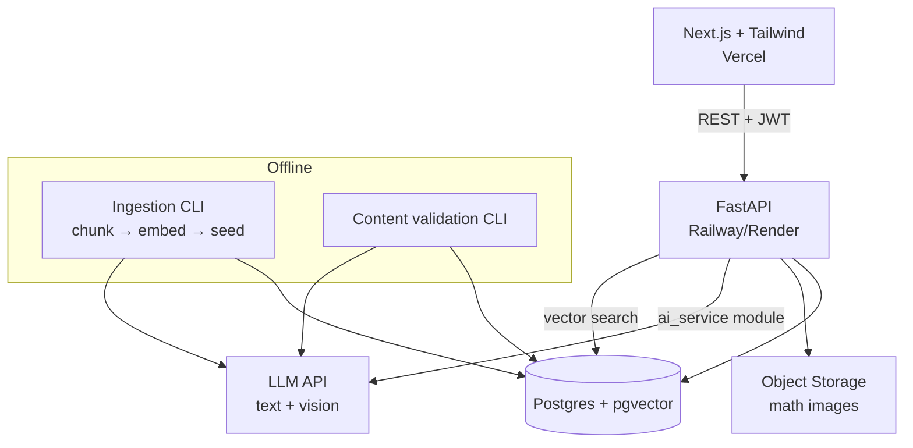

# Zakrily — System Design & Implementation Plan

**Scope:** Junior 4, Unit 1 — English, Math, Science. Web app.
**Team:** 3 people — **AI** (RAG + model features), **BE** (FastAPI + DB), **FE** (Next.js + UI).
**Working method:** contract-first, so all three can work in parallel with AI coding agents from day one.

---

## 0. One decision to re-read before you start

You're starting with RAG immediately so the AI can verify the content taught is correct. Two things to separate:

- **Grounding** (model only speaks from the real Unit 1 textbook) — this is what actually protects correctness, and it's mandatory. ✅
- **Retrieval** (vector search to *find* the right chunk) — this is an optimization for when content is too big to fit in context. For one unit × three subjects, it isn't yet.

So: the RAG pipeline is in this design and you build it now, but note that at Unit 1 scale, retrieval will return nearly the whole lesson anyway. The correctness win comes from the **validation pass** (§4.3) and human review of the seeded content, not from the vector search. Build RAG now because it's the right skeleton for scaling to full curricula — not because it's what makes the content correct. Don't skip human review of the seeded question bank on the assumption that RAG handled it.

---

## 1. Architecture



**Deliberate simplifications for the prototype:**
- AI logic lives as an `ai_service/` module **inside** the FastAPI app, not a separate service. Clean interfaces, one deploy. Split later if needed.
- Ingestion and content validation are **offline CLI scripts**, not runtime endpoints. Content is seeded once and reviewed by a human before students see it.
- pgvector instead of a dedicated vector DB — one less service to run.

---

## 2. Repo Structure

```
zakrily/
├── backend/
│   ├── app/
│   │   ├── main.py
│   │   ├── core/           # config, auth, deps
│   │   ├── models/         # SQLAlchemy models
│   │   ├── schemas/        # Pydantic — THE CONTRACT
│   │   ├── routers/        # auth, path, lessons, quiz, practice, chat, math
│   │   ├── services/       # scoring, question_selection
│   │   └── ai_service/     # retrieval, prompts, math_check, chat, tagging
│   ├── scripts/            # ingest.py, validate_content.py, seed.py
│   └── tests/
├── frontend/
│   ├── app/                # Next.js app router
│   ├── components/
│   ├── lib/api/            # generated client + MSW mocks
│   └── ...
└── content/                # raw Unit 1 source material (PDF/text) per subject
```

---

## 3. Data Model

```sql
users            (id, name, email, password_hash, role[student|parent], created_at)
subjects         (id, slug[english|math|science], name_ar, name_en)
lessons          (id, subject_id, order_index, title, objective, is_published)
lesson_sections  (id, lesson_id, order_index, heading, body_md)

-- RAG
content_chunks   (id, lesson_id, subject_id, source_ref, text, embedding vector(N))

-- Quiz
skill_tags       (id, slug[memorization|comprehension|application|analysis], label_ar)
questions        (id, lesson_id, skill_tag_id, qtype[mcq|short_answer|numeric],
                  body, options jsonb, correct_answer, explanation,
                  source_chunk_id, review_status[pending|approved|rejected])
attempts         (id, user_id, question_id, given_answer, is_correct,
                  context[lesson_quiz|practice], created_at)
skill_scores     (user_id, subject_id, skill_tag_id, correct, total, updated_at)  -- PK(user_id, subject_id, skill_tag_id)
lesson_progress  (user_id, lesson_id, status[locked|unlocked|completed], score, completed_at)

-- Subject features
chat_sessions    (id, user_id, lesson_id, mode[english_convo|science_explain], created_at)
chat_messages    (id, session_id, role[user|assistant], content, created_at)
math_submissions (id, user_id, question_id, image_url, extracted jsonb,
                  verdict[correct|incorrect|unreadable], feedback, created_at)
```

**Rules:**
- `skill_scores` is a materialized aggregate, updated on every attempt write. Don't compute it on read.
- `questions.review_status` — nothing with `pending` is ever served to a student. This is the human-review gate.
- `content_chunks.source_ref` must point back to the real page/section so a wrong answer is traceable.

---

## 4. AI Service Design

### 4.1 Ingestion (offline, `scripts/ingest.py`)
1. Read `content/{subject}/unit1/*` (text or PDF).
2. Split by lesson → section → chunks of ~400–600 tokens, **never crossing a lesson boundary**.
3. Embed each chunk, insert into `content_chunks` with `lesson_id`.

### 4.2 Retrieval
```python
retrieve(query: str, lesson_id: int, k: int = 5) -> list[Chunk]
```
**Always filter by `lesson_id` first, then rank by similarity.** A student in Lesson 3 must never get an answer grounded in Lesson 7 content. This filter matters more than the embedding quality at this scale.

### 4.3 Content generation + validation (offline)
- **Generate:** for each lesson, produce N questions per skill tag, grounded in that lesson's chunks. Model must return `source_chunk_id` for every question.
- **Validate:** a second, separate model call receives `(question, answer, source_chunk)` and returns `{is_supported: bool, is_answer_correct: bool, reason: str}`. Anything failing → `review_status=rejected`.
- **Human review:** you approve the survivors. Build a dead-simple review page (FE-09) — this is not optional, and it's the step that actually guarantees correctness.

### 4.4 Runtime features

| Feature | Interface | Notes |
|---|---|---|
| Science explainer | `explain(lesson_id, question, history) -> str` | Grounded in lesson chunks. Must refuse off-syllabus questions with a fixed message. |
| English conversation | `converse(lesson_id, history) -> {reply, done, feedback?}` | System prompt carries the lesson's target vocab/grammar. Hard turn limit (~10), then returns a feedback summary. |
| Math check | `check_math(image_bytes, question) -> {extracted, verdict, feedback}` | Vision call → structured JSON `{final_answer, steps[]}` → normalize → compare to `correct_answer`. Verdict `unreadable` is a first-class outcome, not an error. |
| Question tagging | `tag_question(body) -> skill_tag` | Offline only, as a suggestion for the human reviewer. Never authoritative. |

**Math scope guard:** v1 judges the **final answer only**. Step-level feedback is best-effort text; if the model can't read the handwriting, return `unreadable` and ask for a clearer photo. Do not gate the feature on step verification working.

---

## 5. API Contract

Write these Pydantic schemas **first** (Ticket BE-01), export OpenAPI, and hand it to FE on day one. FE mocks against it and never waits for BE.

```
POST   /auth/register              -> {token, user}
POST   /auth/login                 -> {token, user}
GET    /me                         -> User

GET    /subjects                   -> [Subject]
GET    /subjects/{slug}/path       -> [{lesson_id, order, title, status, score}]

GET    /lessons/{id}               -> {lesson, sections[]}
GET    /lessons/{id}/quiz          -> {questions[]}          # correct_answer omitted
POST   /lessons/{id}/quiz/submit   -> {score, results[], skill_breakdown[], unlocked_next}

GET    /me/skills?subject=         -> [{skill_tag, correct, total, accuracy}]
GET    /practice/next?subject=&n=  -> {questions[]}          # weak-tag weighted
POST   /practice/submit            -> {results[], skill_breakdown[]}

POST   /chat/sessions              -> {session_id}           # body: {lesson_id, mode}
POST   /chat/sessions/{id}/message -> {reply, done, feedback?}

POST   /math/submit                -> {verdict, feedback, extracted}   # multipart: image + question_id
```

**Two hard rules:**
1. `correct_answer` never leaves the backend on any GET. Grading happens server-side only.
2. Every AI-backed endpoint returns within a bounded time or a structured error — FE renders a retry state, never a hang.

---

## 6. Scoring & Practice Selection (`services/`)

**On quiz submit:** grade server-side → write `attempts` → increment `skill_scores` → recompute `lesson_progress` → unlock next lesson if `score >= 60%`.

**Strength/weakness display:** only show a tag once `total >= 3` for that tag; below that, show "not enough data yet." Showing a student they're "weak at analysis" off one question is noise, and parents will see it.

**Practice selection:**
```
weight(tag) = 1 - accuracy(tag)     # floor at 0.1 so no tag is ever fully starved
sample n questions across tags proportional to weight,
excluding questions answered correctly in the last 24h
```

---

## 7. Task Board

Format is paste-ready for a coding agent. Each ticket: **ID · role · depends on · acceptance criteria.**

### Phase 0 — Contracts & Scaffold (do these first, ~day 1, unblocks everyone)

| ID | Role | Task | Depends | Done when |
|---|---|---|---|---|
| BE-01 | BE | Define all Pydantic schemas in `schemas/` + stub every route in §5 returning hardcoded fixtures. Export `openapi.json`. | — | `openapi.json` committed; every endpoint returns valid shaped fake data |
| BE-02 | BE | Postgres + pgvector up, all §3 tables via Alembic migration | — | `alembic upgrade head` creates full schema clean |
| FE-01 | FE | Next.js + Tailwind scaffold, generate typed API client from `openapi.json`, MSW mocks | BE-01 | App runs, all API calls hit mocks, zero backend dependency |
| AI-01 | AI | Collect + clean Unit 1 source content for all 3 subjects into `content/` | — | Raw text per lesson per subject, committed |

### Phase 1 — The Spine (quiz + scoring + path)

| ID | Role | Task | Depends | Done when |
|---|---|---|---|---|
| BE-03 | BE | Auth: register/login/JWT/`/me` | BE-02 | Register → login → `/me` returns user; bad token → 401 |
| BE-04 | BE | Real `/subjects/{slug}/path` + `/lessons/{id}` from DB | BE-02 | Returns seeded lessons in order with per-user status |
| BE-05 | BE | Quiz serve + submit + server-side grading | BE-04 | `correct_answer` absent from GET; submit writes attempts, returns breakdown |
| BE-06 | BE | `skill_scores` aggregation + `/me/skills` | BE-05 | Scores update on every submit; tags with total<3 flagged `insufficient_data` |
| BE-07 | BE | Practice selection algorithm + endpoints | BE-06 | Weak tags over-represented across 100 sampled runs; recent-correct excluded |
| AI-02 | AI | `ingest.py`: chunk + embed + load `content_chunks` | AI-01, BE-02 | All lessons chunked, `lesson_id` set, retrieval smoke test passes |
| AI-03 | AI | `retrieve()` with lesson_id filter | AI-02 | Query from Lesson 3 never returns a Lesson 7 chunk |
| AI-04 | AI | Question generation grounded in chunks, tagged by skill | AI-03 | ≥8 questions per lesson per subject, each with `source_chunk_id` |
| AI-05 | AI | Validation pass → auto-reject unsupported questions | AI-04 | Deliberately corrupted test question gets rejected |
| FE-02 | FE | Learning path screen (node map, locked/unlocked/completed) | FE-01 | Renders from mock; locked nodes not clickable |
| FE-03 | FE | Lesson content view | FE-01 | Sections render, "start quiz" CTA |
| FE-04 | FE | Quiz flow: question → answer → next → results + skill breakdown | FE-01 | Full flow on mocks, MCQ + short answer + numeric |
| FE-05 | FE | Skills / strengths-weaknesses screen | FE-01 | Handles `insufficient_data` state without crashing |
| FE-06 | FE | Practice mode screen | FE-01 | Reuses quiz component, different entry/exit |

### Phase 2 — Subject Features (ship in this order: easiest → riskiest)

| ID | Role | Task | Depends | Done when |
|---|---|---|---|---|
| AI-06 | AI | Science explainer: grounded chat + off-syllabus refusal | AI-03 | On-topic answered from chunks; off-topic refused with fixed message |
| BE-08 | BE | `/chat/sessions` + `/message`, persist history | AI-06 | Multi-turn history survives reload |
| FE-07 | FE | Chat UI (shared by science + english), loading + error + retry states | FE-01 | No infinite spinner on backend error |
| AI-07 | AI | English conversation: lesson-scoped scenario, turn limit, feedback summary | AI-03 | Ends at turn limit with usable feedback |
| AI-08 | AI | Math check: vision → structured JSON → normalized final-answer compare | AI-01 | ≥80% correct verdicts on a 20-image hand-written test set; unreadable returns `unreadable` |
| BE-09 | BE | `/math/submit`: multipart upload, store image, call AI, persist submission | AI-08 | Image in storage, row in `math_submissions`, verdict returned |
| FE-08 | FE | Math upload UI (camera/file, preview, verdict + feedback, re-shoot on unreadable) | FE-01 | Full loop incl. unreadable path |

### Phase 3 — Gate & Polish

| ID | Role | Task | Depends | Done when |
|---|---|---|---|---|
| FE-09 | FE | Internal content review page: approve/reject/edit questions | BE-05 | Can flip `review_status`; only approved questions served |
| BE-10 | BE | Enforce `review_status=approved` filter on all question serving | FE-09 | Pending question never appears in any quiz/practice response |
| ALL | — | Seed real Unit 1 content, human-review every question | AI-05, FE-09 | 100% of served questions human-approved |
| ALL | — | End-to-end run: register → path → lesson → quiz → weakness → practice → each subject feature | all | One person completes the full loop with no console errors |

---

## 8. How the three of you don't block each other

- **FE never waits for BE.** BE-01 (contract + fixtures) exists on day one; FE builds entirely against MSW mocks and swaps the base URL at the end.
- **BE never waits for AI.** Every AI call sits behind an interface in `ai_service/` with a stub implementation returning canned responses. BE builds and tests routes against the stub; AI swaps in the real implementation.
- **AI never waits for anyone.** Ingestion, generation, validation, and math-check are all CLI scripts testable in isolation before any endpoint exists.

**The one rule:** the contract in `schemas/` changes *only* by agreement between all three. If BE changes a response shape unilaterally, FE finds out at integration and you lose a day.

---

## 9. Testing per role

- **BE:** pytest against a test DB. Priority cases — grading correctness, `correct_answer` leak check, practice weighting distribution, unlock threshold, auth 401s.
- **AI:** fixture-based evals, not unit tests. Keep a small golden set: 20 math images with known answers, 10 on-syllabus + 10 off-syllabus science questions, 5 corrupted questions that validation must reject. Re-run the set after every prompt change.
- **FE:** Playwright on the mock layer for the core flows (quiz completion, practice, chat, upload). Manual pass on mobile viewport — most students will open this on a phone browser.

---

## 10. Risk register

| Risk | Mitigation |
|---|---|
| Math handwriting reading is unreliable | Scoped to final answer only; `unreadable` verdict; ship it last so it can't sink the prototype |
| Generated questions are subtly wrong | Validation pass + mandatory human review gate (BE-10) |
| LLM cost per session runs away | Turn limits on chat, cap retrieval at k=5, log token spend per endpoint from day one |
| Contract drift between the three of you | Schemas are the single source of truth; changes require agreement |
| Scope creep into adaptive paths / voice / more units | Those are explicitly P2 in the PRD — park them |
